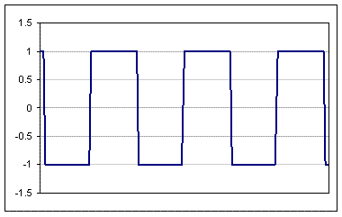
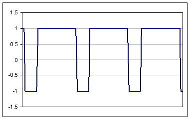
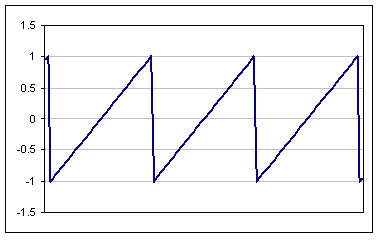
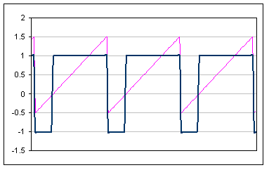

#Create a Pulse Oscillator using the Web Audio API

##Introduction
Many classic analogue synthesiser lead-synth and string-ensemble sounds were based upon a modulated "pulse" waveform.
This project demonstrates a set of techniques for recreating a Pulse Wave using the Web Audio API.

The pulse wave is similar to a normal "square" waveform (figure 1)


... but the "duty-cycle" or "mark-space ratio" is asymmetrical (figure 2).


This creates a very distinctive sound – especially if you can modulate the mark-space ratio (which is what we’re going to do here).

##Implementing the basics
The OscillatorNode provided by the Web Audio API allows you to easily create sine, square, triangle and sawtooth waveforms. We need to be a bit devious to coax a pulse wave out of it.

We start with a normal sawtooth wave:

```javascript
var ac = new AudioContext();

var sawtoothOsc = ac.createOscillator();
sawtoothOsc.type = "sawtooth";
sawtoothOsc.frequency.value = 110;

sawtoothOsc.connect(ac.destination);
sawtoothOsc.start(ac.currentTime);
sawtoothOsc.stop(ac.currentTime + 2);
```

Which gives us a waveform that that rises from -1 to +1 – with an average value of zero (figure 3):


Next we add a WaveShaper node to transform the sawtooth into a square wave:

```javascript
var ac = new AudioContext();

var sawtoothOsc = ac.createOscillator();
sawtoothOsc.type = "sawtooth";
sawtoothOsc.frequency.value = 110;

var pulseCurve =new Float32Array(256);
for (var i=0; i<128; i++){
  pulseCurve [i]=-1;
  pulseCurve [i+128]=1;
}
var pulseShaper=ac.createWaveShaper();
pulseShaper.curve= pulseCurve;

sawtoothOsc.connect(pulseShaper);

//Add an offset here.

waveshaper.connect(ac.destination);
sawtoothOsc.start(ac.currentTime);
sawtoothOsc.stop(ac.currentTime + 2);
```

This uses a symmetrical curve to produce the waveform in figure 4.  Half of the sawtooth wave is below 0 – and so translates to a value of -1.  Half is above 0 – and so translates to +1.
")

To get a pulse wave, we need to add apply an offset to the sawtooth (so that it rises from -0.5 to +1.5).  There are 2 ways of easily creating a constant offset value using the Web Audio API:
* Create an AudioBufferSource (where the AudioBuffer only contains the value that we want).
* Or create another WaveShaper node that shapes all of its input values to the desired constant value.

In this case, it is more convenient to use the WaveShaper method:

```javascript
//Add an offset here.
var constantCurve = new Float32Array(2);
constantCurve[0] = 0.5;
constantCurve[1] = 0.5;
var constantShaper = ac.createWaveShaper();
constantShaper.curve = constantCurve;
sawtoothOsc.connect(constantShaper);
constantShaper.connect(pulseShaper);
```

The WaveShaper node will transform this into an output where a quarter of the output values are -1, and the remaining three quarters are +1.



This is cool, but the resulting sound is a bit static.  It would be better if we use an AudioParam to modulate the pulse-width.
Adding modulation of the pulse width
The Web Audio API doesn’t allow you to create AudioParam object directly … so we’re going to be devious again – and borrow an AudioParam from the GainNode.

The following code adds a new "createPulseOscillator" function to the AudioContext – and exposes a "width" parameter that can be modulated:

```javascript
var ac=new (
  window.AudioContext||
  window.webkitAudioContext||
  function() { throw "Your browser does not support Web Audio API"; }
)();

//Pre-calculate the WaveShaper curves so that we can reuse them.
var pulseCurve=new Float32Array(256);
for(var i=0;i<128;i++) {
  pulseCurve[i]= -1;
  pulseCurve[i+128]=1;
}
var constantOneCurve=new Float32Array(2);
constantOneCurve[0]=1;
constantOneCurve[1]=1;

//Add a new factory method to the AudioContext object.
ac.createPulseOscillator=function(){
  //Use a normal oscillator as the basis of our new oscillator.
  var node=this.createOscillator();
  node.type="sawtooth";

  //Shape the output into a pulse wave.
  var pulseShaper=ac.createWaveShaper();
  pulseShaper.curve=pulseCurve;
  node.connect(pulseShaper);

  //Use a GainNode as our new "width" audio parameter.
  var widthGain=ac.createGain();
  widthGain.gain.value=0; //Default width.
  node.width=widthGain.gain; //Add parameter to oscillator node.
  widthGain.connect(pulseShaper);

  //Pass a constant value of 1 into the widthGain – so the "width" setting
  //is duplicated to its output.
  var constantOneShaper=this.createWaveShaper();
  constantOneShaper.curve=constantOneCurve;
  node.connect(constantOneShaper);
  constantOneShaper.connect(widthGain);

  //Override the oscillator's "connect" and "disconnect" method so that the
  //new node's output actually comes from the pulseShaper.
  node.connect=function() {
    pulseShaper.connect.apply(pulseShaper, arguments);
  }
  node.disconnect=function() {
    pulseShaper.disconnect.apply(pulseShaper, arguments);
  }

  return node;
}
```

We pass a constant value of +1 into the "widthGain" node.  This means that whatever we do to its "gain" parameter will be reflected onto the node’s output.  We attach the "gain" parameter to the oscillator node so that it becomes part of the oscillator’s interface.

##Using the new oscillator node
The new oscillator is demonstrated in the following examples:
* [Example-pwm.html](http://htmlpreview.github.com/?https://github.com/pendragon-andyh/WebAudio-PulseOscillator/blob/master/example-pwm.html)
* [Example-synth.html](http://htmlpreview.github.com/?https://github.com/pendragon-andyh/WebAudio-PulseOscillator/blob/master/example-synth.html)

Have a play - then feel free to incorporate these techniques in your own code.

##Useful links
I found the following links useful for constructing this project:
* [Web Audio API](http://www.w3.org/TR/webaudio/)
* [Sound-on-sound](http://soundonsound.com/sos/feb03/articles/synthsecrets46.asp) - There's a heap of good stuff in this series.

##License
Copyright (c) 2014 Andy Harman and Pendragon Software Limited.

Released under the MIT License.

